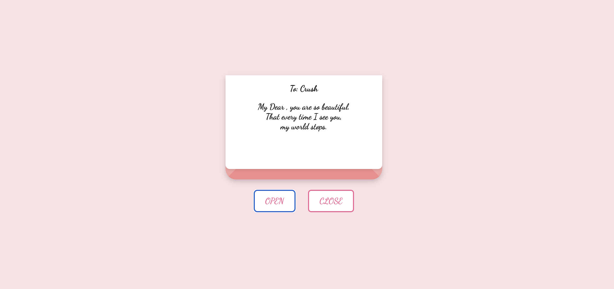

# 💌 Valentine Envelope

This is a beautiful animated Valentine envelope built with love using HTML, CSS, and JavaScript.

Click **OPEN** to unfold the envelope and reveal a sweet love letter.  
Click **CLOSE** to hide it again. The animation mimics a real envelope flap movement.       

---

## 🌐 Live Demo

👉 [View Online](https://tamuna4444.github.io/valentine-envelope/)

---

## ✨ Features

- CSS-only animation
- Responsive and simple layout
- Interactive open/close envelope buttons
- Romantic design 💘

---

## 🛠 Technologies

- HTML5
- CSS3
- JavaScript (for interaction)

---

## 📷 Preview

  
_(Add a screenshot of your project here if you wish!)_

---

## 👩‍💻 Author

Created by **Tamuna Gorgiladze**  
🌍 [GitHub Profile](https://github.com/Tamuna4444)

---

## 📁 Usage

You can fork this repository and customize it for:

- Greeting cards
- Special messages
- Front-end animation practice

Enjoy spreading the love! 💖
